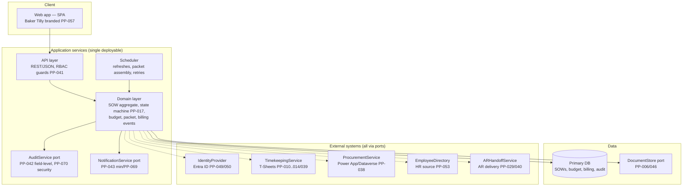
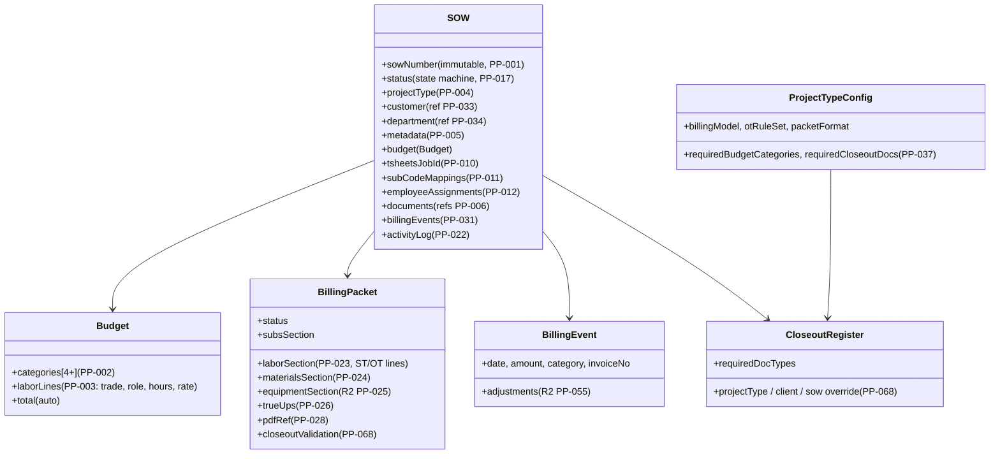

# Architecture — ICE Services Project Lifecycle Platform

| Field | Value |
|---|---|
| Status | BMAD draft v1.0 (2026-09-26) |
| Scope | Phase 1 (R1 detailed; R2/R3 extension points) |
| Decisions | `docs/architecture/decision-register.md` |
| ADRs | `docs/architecture/decisions/` (ADR-001…ADR-005) |
| Synthetic data | `docs/data/synthetic-data-strategy.md` |
| Stack decision | D-001 (platform stack) → **ADR-001**; D-002 (document storage) → **ADR-002** |

## 1. Architecture Goals

1. **Integration isolation (PP-016):** every external system sits behind a
   typed port; business logic never references a vendor SDK or endpoint.
2. **No production data assumption:** every port has a simulator adapter with
   synthetic fixtures, and a config switch selects simulator ↔ real adapter
   per environment.
3. **Auditability by construction (PP-042, PP-070):** audit writes happen in
   the same unit of work as the change; audit is append-only.
4. **R1 boundary enforceability:** the feature sequence and RBAC keep R2/R3
   capabilities out of the R1 path.
5. **Boring, supported technology** in a Microsoft-centric shop. D-001
   (platform stack) and D-002 (document storage) are now **decided for
   development** (ADR-001, ADR-002): Python/FastAPI + React, Azure Blob behind
   the `DocumentStore` port, Entra ID OIDC behind `IdentityProvider` (ADR-003).
   The architecture below stays language-neutral on purpose, so the decided
   stack does not change any port, domain model, or simulator.

## 2. High-Level View



**Deployment model:** one web application (API + SPA) + one primary database +
document storage. No message broker in R1 (queue volumes don't justify one);
the scheduler uses a database-backed job table. Revisit if R2 GL sync (PP-054)
introduces asynchronous volume (D-034).

## 3. Layering & Rules

| Layer | May depend on | Must not |
|---|---|---|
| API (controllers, DTOs, auth guards) | Domain, ports | Vendor SDKs, DB engine specifics |
| Domain (aggregates, state machine, rules) | Ports (interfaces), value objects | Vendor SDKs, HTTP, framework types |
| Adapters (per port) | Vendor SDKs, HTTP | Domain types beyond the port contract |
| Infrastructure (DB, scheduler, config) | ADO/ORM, ports | — |

Enforcement: an architecture/dependency test in CI (Feature 001) fails the
build if any domain file imports a vendor package. This is the PP-016 test.

## 4. Domain Model (core, R1)



**Conventions**
- SOW is the root aggregate; status transitions only via the state machine
  service (PP-017).
- Money stored as integer minor units (cents) + currency code; never float.
- All timestamps UTC.
- SOW number assigned in the activation transaction (DB sequence with
  reservation semantics; concurrency-safe per PP-001 AC-3).

## 5. Service Interfaces (Ports)

> Contract style: language-neutral (these map 1:1 to a typed interface in the
> chosen stack, D-001). All methods are async. All return `Result<T>` with an
  explicit error shape; adapters must not throw across the port boundary.
> Every port has: real adapter, simulator adapter, contract test suite,
> config switch — details in §6 and `docs/data/synthetic-data-strategy.md`.

### 5.1 IdentityProvider (PP-049, PP-050, PP-051)

Authenticates users; returns an identity + role claims bundle.

```
interface IdentityProvider {
  authenticate(request: LoginRequest) -> AuthSession
  validateSession(token: string) -> IdentityContext | SessionExpired
  getUser(userSubject: string) -> IdentityUser
  mapRoles(identity: IdentityUser) -> Role[]        // PP-041
  beginMfa(request: LoginRequest) -> MfaChallenge    // PP-050
}

IdentityUser { subject, name, email, externalId, mfaEnrolled }
Role ∈ { NS_ADMIN, OPS_ACCOUNTING, PROJECT_MANAGER, EXECUTIVE,
         AR, FINANCE_FPA, SYSTEM_ADMIN }              // PP-041 minimum set
```

- **Real adapter:** Entra ID (OAuth2/OIDC) per D-007.
- **Simulator:** `SimIdentityProvider` — accepts fixture users from
  `fixtures/identity/users.json`, returns configured roles; supports a
  "force failure" flag for error-path tests.
- **Contract tests:** session validation round-trip; unknown token →
  `SessionExpired`; role mapping stable; MFA challenge flow.
- **Config:** `identity.provider = entra | sim` (see §7).
- **Unresolved:** exact role list and AR/Finance direct-login need (D-007);
  AIG Portal vs Entra group mapping; MFA method per ICE IT (D-028); session
  timeout value (D-027).

### 5.2 TimekeepingService (T-Sheets) (PP-010–014, PP-039)

```
interface TimekeepingService {
  // provisioning
  createJob(req: CreateJobRequest) -> JobRef          // PP-010
  createSubCode(req: CreateSubCodeRequest) -> SubCodeRef  // PP-011
  assignEmployee(jobRef, subCodeRef, employeeId, effectiveFrom) -> AssignmentRef  // PP-012
  unassignEmployee(assignmentRef, effectiveFrom) -> Ok   // PP-013
  activateJob(jobRef) -> Ok
  deactivateJob(jobRef) -> Ok

  // retrieval
  getTimesheetEntries(q: { jobRef | subCodeRef, employeeId?, from, to })
                    -> TimesheetEntry[]                // PP-014

  // health
  healthCheck() -> AdapterHealth
}

CreateJobRequest  { sowNumber, description, clientRef, externalRef? }
TimesheetEntry    { employeeId, subCodeRef, date, startTs?, endTs?, hours, sourceId }
```

- **Real adapter:** T-Sheets REST API (endpoint/auth details from DISC-001
  spike; **unconfirmed capabilities**: sub-code creation, employee
  restriction, timestamp granularity — see §8.2).
- **Simulator:** `SimTimekeepingService` — in-memory job/sub-code registry
  seeded from `fixtures/timekeeping/`; generates deterministic synthetic
  timesheet entries from `fixtures/timekeeping/timesheets.json` (per SOW
  number, discipline, date range); honors activate/deactivate for charging
  rules.
- **Contract tests:** idempotent job creation (same `externalRef` → same
  `JobRef`); sub-code round-trip; assignment visible in read-back;
  deactivation blocks new entries (simulator enforces); error mapping (auth
  failure → `AdapterAuthError`; not found → `AdapterNotFound`; timeout →
  `AdapterTimeout` — all retryable-classed).
- **Config:** `timekeeping.provider = tsheets | sim`.
- **Unresolved:** sub-code API (DISC-001, D-010); timestamp availability
  (OT determination depends on it); rate limits; sandbox credentials;
  deactivation semantics on reopen (D-011).

### 5.3 ProcurementService (Power App / Dataverse) (PP-038)

```
interface ProcurementService {
  getPurchaseOrders(q: { sowNumber | projectIdentifier, status? }) -> PO[]   // PP-038
  getReceivedGoods(q: { poId | sowNumber, from, to }) -> ReceivedGood[]
  getStockIssues(q: { sowNumber, from, to }) -> StockIssue[]
  getVendor(vendorId) -> Vendor
  getCostData(q: { sowNumber }) -> CostLine[]
  healthCheck() -> AdapterHealth
}

PO { poNumber, status, vendor, lines[POLine], sowNumber?, projectIdentifier?, totalCost }
```

- **Real adapter:** Dataverse OData/Web API (assumed; DISC-003 to confirm
  stable API surface and the PO↔SOW matching field).
- **Simulator:** `SimProcurementService` — seeded POs/receipts/vendors from
  `fixtures/procurement/`; includes an intentional "unmatched PO" fixture to
  exercise the exception path in PP-026.
- **Contract tests:** filter by SOW number returns only matching POs;
  unmatched records return with `sowNumber = null` (not dropped); PO status
  enum stable; error mapping.
- **Config:** `procurement.provider = dataverse | sim`.
- **Unresolved:** which departments are on the Power App; which field carries
  the SOW/job number (DISC-003, D-018); auth model for OData (service
  principal vs delegated) — see §8.3.

### 5.4 DocumentStore (PP-006, PP-046)

```
interface DocumentStore {
  store(doc: StoredDocument) -> DocumentRef          // returns URL/metadata
  open(docRef) -> DocumentStream
  delete(docRef) -> Ok                               // soft-delete preferred
  list(q: { sowId, docType?, from?, to? }) -> DocumentMeta[]
  search(q: { sowNumber, docType?, dateRange? }) -> DocumentMeta[]  // PP-046
  healthCheck() -> AdapterHealth
}

StoredDocument { sowId, docType, fileName, mimeType, size, uploadedBy, tags[] }
DocumentMeta  { ref, sowId, docType, uploadedAt, size, checksum, url }
```

- **Real adapter:** Azure Blob (R1 recommendation, D-002) with SAS/Entra
  scoped URLs; SharePoint adapter possible if D-002 chooses it — same port.
- **Simulator:** `SimDocumentStore` — local filesystem under
  `sim-state/documents/`, same API surface; content-addressed checksums.
- **Contract tests:** store→open round-trip; list/search filters; metadata
  integrity (checksum); concurrent store of same name (unique refs).
- **Config:** `documents.provider = blob | sharepoint | sim`.
- **Unresolved:** D-002 final choice; retention policy (D-030); whether
  SharePoint library metadata can be reused or must be mirrored; large-file
  limits.

### 5.5 EmployeeDirectory (PP-053)

```
interface EmployeeDirectory {
  getEmployee(employeeId) -> Employee
  search(q: { name?, email?, department?, activeOnly? }) -> Employee[]
  listDepartment(departmentId) -> Employee[]
  healthCheck() -> AdapterHealth
}

Employee { employeeId, name, email, department, jobTitle, active }
```

- **Real adapter:** HR system of record — **source unconfirmed (DISC-006)**;
  adapter shape stays the same for Paylocity/Workday/local.
- **Simulator:** `SimEmployeeDirectory` — seeded from
  `fixtures/employees/employees.json` (includes active + inactive +
  cross-department cases).
- **Contract tests:** active/inactive filter; search determinism; unknown
  ID → `AdapterNotFound`; project-role independence (directory never returns
  project roles).
- **Config:** `employee.provider = {hr-source} | sim`.
- **Unresolved:** authoritative source (DISC-006); auth (service account vs
  OAuth); data freshness SLA; whether department master (PP-034) is derived
  from HR or independently maintained (D-023).

### 5.6 ARHandoffService (PP-029, PP-040)

```
interface ARHandoffService {
  deliver(bundle: HandoffBundle) -> HandoffResult
  deliveryStatus(handoffId) -> HandoffStatus
  listHandoffs(q: { sowId, from?, to? }) -> HandoffRecord[]
  healthCheck() -> AdapterHealth
}

HandoffBundle { sowId, packetPdfRef, supportingDocs[DocumentRef],
                invoiceDraftRef?, metadata }
HandoffResult { handoffId, status, deliveredAt?, error? }
HandoffStatus ∈ { QUEUED, DELIVERED, FAILED }
```

- **Real adapter (R1 recommendation):** shared-folder deposit (file copy to
  agreed AR location, D-020); portal or email adapters are alternate
  implementations of the same port.
- **Simulator:** `SimARHandoff` — writes bundle to `sim-state/ar-handoff/`
  and records a `HandoffRecord`; supports injectable `FAILED` for retry-path
  tests.
- **Contract tests:** deliver→status round-trip; retry after FAILED; bundle
  integrity (all listed docs present in destination); handoff record
  immutability.
- **Config:** `arhandoff.provider = folder | portal | email | sim`.
- **Unresolved:** mechanism (D-020, DISC-013); naming/location convention
  with AR; whether AR needs read-back confirmation or fire-and-forget;
  credentials for target location.

### 5.7 AuditService (PP-042, PP-070)

```
interface AuditService {
  record(e: AuditEvent) -> Ok          // called in the same UoW as the change
  query(q: AuditQuery) -> AuditPage    // explorer + per-SOW drill (S-37/S-85)
  export(q: AuditQuery) -> ExportJob   // CSV, PP-042/PP-070
}

AuditEvent { actor, actorType(USER|SYSTEM), entity, entityId,
             field?, oldValue?, newValue?, action, reason?,
             correlationId, atUtc }
SecurityEvent { user, attempt, success, atUtc, sourceIp, userAgent,
                sessionDuration?, logoutAt? }     // PP-070
```

- **Real adapter:** append-only table in the primary DB with no
  application-level UPDATE/DELETE paths + periodic export to cold storage
  per retention (D-030).
- **Simulator:** same interface over an in-memory/file store for unit tests;
  production always uses the DB adapter (audit must never be "simulated" in
  a real environment — config option exists only for test harnesses).
- **Contract tests:** record→query round-trip; immutability (no API can
  mutate rows); export completeness; correlationId joins audit to activity
  log (PP-022).
- **Config:** `audit.sink = db` (fixed in prod), `audit.retention = {D-030}`.
- **Unresolved:** retention period per ICE policy (D-030); whether security
  events must also land in an external SIEM (register silent); export
  format for compliance.

### 5.8 NotificationService (PP-043 min, PP-052, PP-069)

```
interface NotificationService {
  send(n: Notification) -> DeliveryRef
  createTask(t: WorkflowTask) -> TaskRef      // in-app queue item (S-11/S-51)
  deliveryStatus(deliveryRef) -> DeliveryStatus
}

Notification { channel(IN_APP|EMAIL), recipients[IdentityUser],
               template, params, eventId }
WorkflowTask { queue, sowId, title, due?, assigneeRole }
```

- **Real adapter (R1):** in-app task table (same DB) + SMTP relay for email
  (ICE mail relay, D-021).
- **Simulator:** `SimNotificationService` — records to `sim-state/notifications/`
  for assertion in tests; never sends real mail in CI/DEV.
- **Contract tests:** send→status round-trip; recipient resolution via
  IdentityProvider; task creation visible in queue; email templating
  determinism.
- **Config:** `notifications.provider = relay+inapp | sim`.
- **Unresolved:** relay credentials/sender address (D-021); recipient lists
  per event (register: configurable — R2); bounce/undeliverable handling.

## 6. Simulator Strategy (summary)

Full fixture formats, seeding rules, and contract-test harness are defined in
`docs/data/synthetic-data-strategy.md`. Summary:

- One `simulator` package implements all 8 ports; a single
  `Simulators` facade seeds from `fixtures/` (JSON) into `sim-state/`.
- Every simulator is **deterministic** (seeded generation) so tests are
  reproducible.
- Simulators include **negative fixtures** (unmatched PO, inactive employee,
  failed delivery, auth expiry) so error paths are exercised in CI.
- Contract tests run against **every** adapter (real and sim) — the suite is
  adapter-agnostic, parameterized over the port.
- The real adapter for each port is written against the contract first, then
  verified against the sandbox once credentials arrive (D-033).

## 7. Configuration & Adapter Switching

> **Decided defaults (2026-09-26):** `identity.provider = sim` (dev/CI) /
> `entra` (prod) — ADR-003; `documents.provider = sim` (dev/CI) / `blob`
> (prod) — ADR-002. The rest of the provider keys keep their sim/real split
> and are unaffected. Secrets stay in the secret store, never in the config
> file.

Central config file / env configuration (e.g., `config.json` + environment
variables, or `.env`), per environment:

```jsonc
{
  "environment": "dev | test | prod",
  "identity":     { "provider": "entra | sim", "tenant": "…" },
  "timekeeping":  { "provider": "tsheets | sim", "baseUrl": "…", "apiVersion": "…" },
  "procurement":  { "provider": "dataverse | sim", "endpoint": "…", "environment": "…" },
  "employee":     { "provider": "hr | sim", "source": "…" },
  "documents":    { "provider": "blob | sharepoint | sim", "container": "…" },
  "arhandoff":    { "provider": "folder | portal | email | sim", "target": "…" },
  "audit":        { "sink": "db", "retention": "…" },
  "notifications":{ "provider": "relay+inapp | sim", "relay": "…" }
}
```

Rules:
- Provider selection is **per-adapter, per-environment** — e.g., DEV can run
  with all simulators while identity is real Entra.
- Switching requires no code change and (for most adapters) no restart for
  the sim↔real swap at env level; runtime switching is an admin action
  (S-84) with audit logging of the switch event (PP-042).
- `prod` may only use real providers, except `SimDocumentStore`/`SimARHandoff`
  are forbidden in prod (enforced by a startup validation).
- Secrets (tokens, connection strings) from the secret store, never in the
  config file.

## 8. External System Integration Notes

### 8.1 Identity (Entra ID) — decided for development (ADR-003)
SSO (OIDC) + MFA via Conditional Access (D-028) is the **production** path.
**Decided (D-007 / ADR-003):** production authN = Entra ID OIDC (via
`python-msal`); role assignment = **in-app role table** keyed by the Entra
subject (managed via the PP-051 admin UI); MFA = **Entra Conditional Access**
(the app does not re-implement MFA in prod). Development/CI uses
`SimIdentityProvider`. Identity provisioning stays in Entra. D-009 (RBAC
matrix), D-027 (session timeout), D-028 (MFA method) remain open values.

### 8.2 T-Sheets — unconfirmed capabilities (DISC-001)
| Capability | Status | Impact if unavailable |
|---|---|---|
| Job create via API | likely OK (confirm in spike) | manual job creation + ID entry (degraded) |
| Sub-code create via API | **unconfirmed** 🔴 | manual sub-codes + admin mapping table (D-010 fallback) |
| Employee restriction per sub-code | **unconfirmed** | charging control via deactivation only; accept risk (D-010) |
| Time entries with start/end timestamps | **unconfirmed** | OT determination degrades to day-level (R1 min rule still works; R2 engine blocked) |
| Activate/deactivate job | likely OK | manual deactivation + reminder task |
| Error semantics / rate limits | unknown | retry/backoff policy (DISC-001) |

### 8.3 Procurement Power App / Dataverse — unconfirmed (DISC-003)
- Assume OData Web API on Dataverse; confirm stable entity set + field names.
- **Matching:** PO must carry SOW number or project identifier — confirm
  which; if absent, fall back to CSV import of approved POs (release-plan
  contingency).
- Auth: service principal (app-only) recommended; confirm with IT.

### 8.4 HR source — unconfirmed (DISC-006)
Any of Paylocity/Workday/local. Port + simulator mean the choice is deferred;
until confirmed, `SimEmployeeDirectory` + admin-managed employee list is the
operational path.

### 8.5 AR handoff — unconfirmed (D-020, DISC-013)
R1 default: shared-folder deposit. Same port supports portal/email.

## 9. Security Architecture (PP-041, PP-049–052, PP-070)

- AuthN: IdentityProvider (Entra OIDC preferred, D-007).
- AuthZ: role-based, enforced server-side on every endpoint; role matrix in
  D-009; claims carried in session token; no client-side authorization trust.
- MFA: per ICE policy (D-028).
- Audit: AuditService (§5.7); security events (PP-070) separate stream.
- Data: TLS in transit; encryption at rest per platform defaults; PII (employee
  data) minimized — employeeId + name + email only.
- Documents: access scoped per SOW via RBAC + short-lived URLs.

## 10. Performance & Availability (PP-045)

- Targets pending D-026/DISC-015; R1 baseline: packet assembly (labor +
  materials) ≤ 30s p95 for a 500-line SOW (interim target, revise at DISC-015).
- Scheduler jobs (daily labor/PO refresh) run off-peak; idempotent.
- Availability: business-hours SLA per D-026; platform-level (App Service /
  equivalent) with DB HA per platform defaults.
- Concurrency: SOW number reservation prevents duplicates under concurrent
  activation (PP-001).

## 11. CI/CD & Environments (PP-056)

> **Decided (D-029 / ADR-004):** GitHub Actions substrate; `main` branch
> protection + PR review; automatic DEV deploy on `main`; **tag-based release**
> → DRY-RUN → PROD behind a **manual approval gate**. The CI gate is the full
> lint/typecheck/unit/contract/integration/architecture(PP-016)/frontend-build
> suite. See `decisions/ADR-004-ci-cd-and-release-controls.md`.

```
repo → build (deps, typecheck, unit) → test (contract vs simulators,
      integration vs sim stack) → package → deploy DEV → [staging/dry-run]
      → release controls (D-029) → PROD
```

- Environments: DEV (all simulators allowed), DRY-RUN (real identity + real
  DB + sim external adapters + real document store, for cutover rehearsal),
  PROD (real adapters only).
- Release controls: branch protection, PR review, tag-based deploy, approval
  gate to PROD (D-029).
- Migration console (S-88) runs as a controlled job, not a pipeline step, in
  DRY-RUN and PROD (PP-044).

## 12. Testing Strategy (architecture-level)

| Level | Against | Purpose |
|---|---|---|
| Unit | domain, pure logic | state machine, budget math, OT min rule, relevance filter |
| Contract | **every port adapter** (sim + real) | §5 contracts hold; error mapping |
| Integration | sim full stack | workflows WF-1…WF-6 end-to-end on fixtures |
| Dry-run | real identity + real data (historical) | R1 exit gate acceptance |
| Architecture | dependency rules | PP-016 isolation; no vendor imports in domain |

## 13. Extension Points (R2/R3)

- OT rule engine (PP-015/036): replaces the R1 minimum rule behind the same
  `Otdetermination` domain service — call sites unchanged.
- Change orders (PP-020): new aggregate linked to SOW; budget mutation path
  gains a "CO-adjusted" source tag.
- Equipment (PP-025): new port `EquipmentService` (source DISC-004) + packet
  section; reconciliation workspace tab already reserved.
- GL sync (PP-054): new port `GLService`; write-back only in R2 per D-024.
- Reporting (PP-048/071) and accrual (PP-032): read-only views over the same
  tables; no schema change expected.
- Notification center (PP-043): NotificationService gains templates/recipients
  config; R1 task + email path unchanged.
