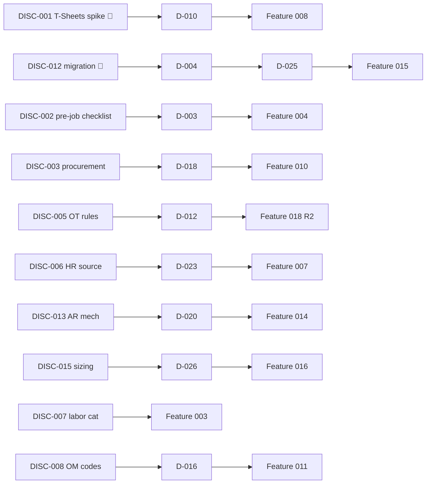

# Discovery Backlog — ICE Services Project Lifecycle Platform

| Field | Value |
|---|---|
| Status | BMAD draft v1.0 (2026-09-26) |
| Source | `docs/source/phase-1-requirements-register-v2.2.md` v2.2 (authoritative) |
| Purpose | Technical unknowns and open investigations. Each is a bounded, time-boxed discovery task, not a feature. |
| Decisions | Outcomes feed `docs/architecture/decision-register.md` (D-xxx) |

**Statuses:** `Not started`, `In progress`, `Done — outcome recorded`.
**Priority:** 🔴 = blocker/critical path, ⚠️ = high, ○ = medium.

> Discovery is investigation work: read docs, run sandbox calls, interview the
> owner, produce a **written answer + recommendation**. It is **not** application
> code. Each item lists its **exit question** (what must be answered) and its
> **output** (where the answer lands).

## 1. Discovery Items

| ID | Item | Pri | Rel | Exit question | Output |
|---|---|---|---|---|---|
| DISC-001 | **T-Sheets sandbox spike (PP-047 🔴)** — validate job create, sub-code create, employee assignment/restriction, time-entry start/end timestamps, activate/deactivate, error semantics & rate limits | 🔴 | Pre-R1 | Can we create sub-codes + restrict employees via API? Do time entries carry timestamps? What are the error/rate behaviors? | Spike report → feeds D-010; gates Feature 008. **Critical path — start first.** |
| DISC-002 | **Pre-job obligations checklist (PP-007)** — enumerate the obligations per project type (Hard Dollar/T&M/OMR/Camp) and which are mandatory vs waivable | ⚠️ | R1 | What are the concrete pre-job obligations for each project type, and who validates them? | Checklist content → D-003; seeds Feature 004/006 config. |
| DISC-003 | **Procurement Power App / Dataverse API (PP-038, PP-024)** — confirm stable OData/Web API surface, entity/field names, and the field that carries the SOW/job number for PO matching; which departments are fully on the Power App | ⚠️ | R1 | Which entity/field links a PO to an SOW? Is the API stable and service-principal-able? | API contract + matching field → D-018; real `ProcurementService` adapter. |
| DISC-004 | **Equipment / stock-issue source (PP-025)** — identify the system of record for equipment charges and stock-issue reports | ⚠️ | R2 | Where do equipment/stock-issue records live, and can we read them? | Source + read path → new `EquipmentService` port design (R2). |
| DISC-005 | **Overtime rules list (PP-015, PP-036)** — obtain the structured OT rules from the client (defaults, project-type & client overrides, after-hours rates, special thresholds) | ⚠️ | R1/R2 | What are the exact OT rules, in machine-readable form, for the R1 minimum and the full R2 set? | Rules spec → D-012; R1 minimum rule + R2 engine. |
| DISC-006 | **HR / employee source (PP-053, PP-034)** — confirm the authoritative employee/department source (Paylocity / Workday / local) and its read API | ⚠️ | R1 | Which system is the employee + department system of record, and how do we read it? | Source + read path → real `EmployeeDirectory` adapter; feeds D-023. |
| DISC-007 | **Labor category master (PP-035)** — obtain the full two-level trade/discipline → role-level list from rates/bid sheets | ⚠️ | R1 | What is the complete labor classification list to seed the master? | Seed data → Feature 003. |
| DISC-008 | **OM code list + treatment (PP-019)** — obtain the OM code list and confirm billing treatment | ○ | R1 | What OM codes exist and how are they billed (or not)? | Seed data + billing rule → D-016; Feature 003. |
| DISC-009 | **Change order design (PP-020)** — confirm CO as first-class record vs budget edit, and the approval workflow | ⚠️ | R2 | Is a CO a standalone record with its own budget delta + approval, or a budget edit? | Design → D-008; Feature 017. |
| DISC-010 | **Progress billing rules (PP-021)** — determine whether/when the progress-billing *workflow* rules exist (data tracking is R2; workflow deferred until rules) | ○ | R2 | Are progress-billing rules defined? If not, R2 delivers data tracking only. | Scope decision → Feature 017 scope. |
| DISC-011 | **Accrual workbook/formula (PP-032, PP-072)** — obtain Shannon's accrual workbook/formula and reconcile it to system data (incl. the project financial / accrual-support report fields) | ⚠️ | R3 | What exact formula/data produces the monthly accrual and the project financial / accrual-support reports, so the system can reproduce them? | Formula + report spec → D-032; Feature 022. |
| DISC-012 | **Migration source inventory (PP-044 🔴, PP-001, PP-033)** — obtain Access DB, Excel logs, customer master file, SharePoint job list + doc refs; map schemas and the SOW-number sequence | 🔴 | R1 | What are the exact source schemas, record counts, and the current max SOW number for sequence continuity? | Mapping spec + sequence → D-004, D-025; Feature 015. |
| DISC-013 | **AR handoff mechanism (PP-029, PP-040)** — confirm the AR delivery mechanism (folder/portal/email/S2S), location, naming, and any read-back | ⚠️ | R1 | How exactly does AR receive a packet, and do they confirm receipt? | Mechanism + convention → D-020; real `ARHandoffService` adapter. |
| DISC-014 | **GL / accounting interface (PP-054)** — confirm the interface mechanism for billing identifiers, invoice numbers, payment status | ⚠️ | R2 | What is the GL/AR interface, and what can we write back in R2? | Interface spec → D-024; `GLService` port (R2). |
| DISC-015 | **Sizing & SLA (PP-045)** — confirm expected user count, concurrent-use profile, largest SOW size, and availability SLA | ⚠️ | R1 | How many users, what concurrency, how big a SOW, what SLA? | Targets → D-026; architecture §10. |
| DISC-016 | **Brand assets (PP-057)** — obtain Baker Tilly logo, color, typography tokens | ○ | R1 | What are the exact brand tokens to ship in `brand/tokens.json`? | Token file → UX spec §2. |
| DISC-017 | **Client-specific packet layouts (PP-027)** — enumerate the client/project-type packet layout requirements (esp. T&M/OMR estimate-vs-actuals) | ○ | R2 | What layouts are required per client/type? | Layout spec → Feature 020. |

## 2. Dependency Map (discovery → feature)

## 3. Critical-Path Discovery (start immediately, do not wait for Feature 001)

1. **DISC-001 (T-Sheets spike 🔴)** — the single biggest risk (PP-047, PP-011).
   The outcome decides the Feature 008 design (API-driven vs manual-mapping
   fallback). Time-box: 1–2 weeks. Owner: PM + developer.
2. **DISC-012 (migration inventory 🔴)** — PP-044 "cannot go live without it."
   Source files and schema mapping must be available before Feature 015. Owner:
   NSA + OPA.
3. **DISC-015 (sizing/SLA)** — needed to set architecture §10 targets before
   performance work in Feature 016. Owner: PM.

## 4. Discovery vs Decision Boundary

- **Discovery (this file):** *What is the technical reality?* (API exists? field
  names? source system? list contents?)
- **Decision (decision register):** *Given that reality, what do we choose?*
  (which fallback, which mechanism, which thresholds?)

Every DISC item that produces a "which option" question is paired with a D-xxx
decision. No discovery item resolves a decision on its own, and no decision is
recorded as `Decided` before its discovery (if any) is `Done`.

## 5. Definition of Done (per discovery item)

- [ ] Exit question answered with evidence (doc excerpt, sandbox response,
      interview note).
- [ ] Written recommendation produced.
- [ ] Paired D-xxx decision updated (`Proposed`/`Decided`) or created.
- [ ] Affected feature's acceptance criteria updated if the answer changes them.
- [ ] No application code written (discovery is investigation only).
