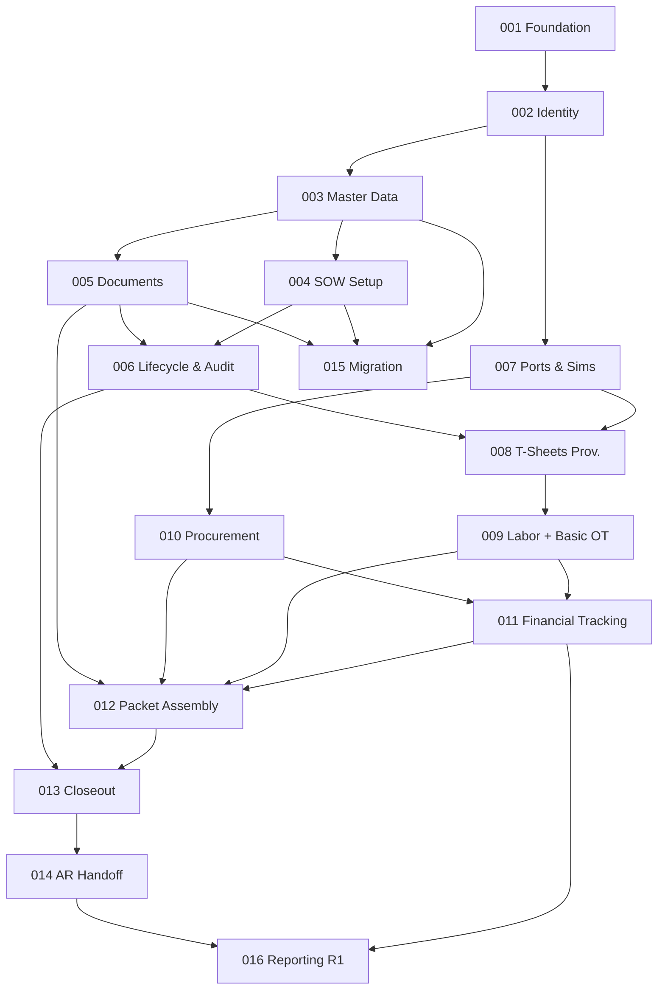

# Feature Sequence — ICE Services Project Lifecycle Platform

| Field | Value |
|---|---|
| Status | BMAD draft v1.0 (2026-09-26) |
| Source | `docs/source/phase-1-requirements-register-v2.2.md` v2.2 (authoritative) |
| Traceability | `docs/product/requirements-traceability.md` |
| Method | Spec Kit turns each feature into an implementation-ready spec; Ralph implements one at a time, in order. |

## 1. Sequencing Rules

1. **Dependency first:** a feature may only be scheduled after every feature
   it depends on (transitively) is complete.
2. **R1 boundary is binding:** R2/R3 features never enter the R1 path except the
   two minimum behaviors (PP-023 OT flag, PP-069 notification).
3. **Risk early on the critical path:** the T-Sheets spike (DISC-001/PP-047 🔴)
   and migration inventory (DISC-012/PP-044 🔴) are **discovery**, started
   immediately — they gate Features 008 and 015 respectively.
4. **Vertical, not horizontal:** each feature is a working slice (UI + domain +
   adapters + tests), not a layer.
5. **Simulator-backed:** every feature that touches an external system runs
   against simulators in CI and is verifiable without production data.

## 2. Proposed Sequence (from run brief) vs Reviewed Sequence

The run brief proposed 16 R1 slots. Reviewing against the traceability matrix
and the R1 boundary rule reveals **one required change**: the proposed slot
**"014 Change Orders and Billing Extensions"** is **R2 scope** (PP-020, PP-021,
PP-055 are all R2-assigned). It cannot sit in the R1 path per the binding R1
boundary rule.

**Resolution:** keep the R1 sequence at 16 features (001–016) by *renaming* the
proposed slot 014 to its actual R1 content — **AR Handoff & Billing Tracking**
(PP-029/031/040, all R1). Change Orders & Billing Extensions moves to **R2 as
Feature 017**. All other slots keep their numbers and content.

> No R1 requirement is dropped. The R1 set is unchanged (49 requirements); only
> the *label* of one slot was corrected to match the authoritative release
> assignments.

## 3. Reviewed R1 Sequence (001–016) — with dependencies

| # | Feature | Rel | Primary PP | Depends on | Gates / Notes |
|---|---|---|---|---|---|
| 001 | Platform Foundation & CI/CD | R1 | PP-056, PP-057, PP-016 (conventions), PP-045 (baseline) | D-001, D-029 | Scaffolds app shell, DB, ports, sim harness, CI/CD. Everything builds on this. |
| 002 | Identity & Access | R1 | PP-041, PP-042 (port), PP-049, PP-050, PP-051, PP-052, PP-070 | 001 | RBAC + SSO/MFA + audit/security log + user mgmt. Needed before any authorized action. |
| 003 | Master Data & Configuration | R1 | PP-033, PP-034, PP-035, PP-037, PP-019 (list), PP-068 (register) | 002 | Customers/depts/labor/project-types/closeout-register/OM. Drives SOW form + validation. |
| 004 | SOW Core Setup | R1 | PP-001, PP-002, PP-003, PP-004, PP-005, PP-007 (intake), PP-009 | 003 | SOW create form, budget, number, metadata, pre-job checklist. |
| 005 | Document Management | R1 | PP-006, PP-046 | 002, 003 | DocumentStore usage: attach/view/search, doc types. Feeds closeout validation. |
| 006 | SOW Lifecycle & Audit | R1 | PP-007 (activation), PP-008, PP-017, PP-022, PP-042 (usage) | 004, 005 | State machine, activation, edit/amend, activity log, field-level audit. |
| 007 | Integration Ports & Simulators | R1 | PP-016, PP-038 (port), PP-053 (port), + Notification/AR/Audit ports | 001 | All 8 ports + sim adapters + contract tests + config switch. Foundation for 008–010. |
| 008 | T-Sheets Provisioning | R1 | PP-010, PP-011, PP-012, PP-013 (deactivate), PP-039 (prov.), PP-047 (gate) | 006, 007 | Job/sub-code/assignment provisioning. **Gated by DISC-001 spike (D-010).** |
| 009 | Labor Retrieval & Basic OT | R1 | PP-014, PP-015 (R1 min), PP-023 (labor calc), PP-039 (retr.) | 008 | Time retrieval + ST/OT min rule + labor charge calc. |
| 010 | Procurement & Project Costs | R1 | PP-038 (usage), PP-024 (retrieval) | 007 | PO/received/vendor/cost retrieval + PO↔SOW matching. |
| 011 | Project Financial Tracking | R1 | PP-018, PP-019 (usage), PP-031 (data model) | 009, 010 | Budget-to-actual dashboard + billed-to-date data model + OM usage. |
| 012 | Billing Packet Assembly | R1 | PP-023, PP-024, PP-026, PP-028, PP-068 (validation), PP-045 (assembly) | 009, 010, 011, 005 | Reconciliation workspace, true-up, closeout-doc validation, PDF + filter. |
| 013 | Closeout & Reconciliation | R1 | PP-013 (reopen), PP-029 (status), PP-030, PP-031 (event), PP-043 (R1 min), PP-069 | 006, 012 | Closeout trigger, hold loop, billing event, min notification. |
| 014 | **AR Handoff & Billing Tracking** | R1 | PP-029 (delivery), PP-031 (tracking), PP-040 | 013 | AR delivery mechanism + billed-to-date tracking + handoff log. *(renamed from proposed "Change Orders")* |
| 015 | Data Migration & Cutover | R1 | PP-044, PP-001 (sequence), PP-033 (customer data) | 003, 004, 005 | One-time migration, validation report, cutover sign-off. **Gated by DISC-012 (D-025).** |
| 016 | Reporting & Accrual (R1 slice) | R1 | PP-018 (views), PP-031 (report) | 011, 014 | Budget-to-actual report + billed-to-date report. (Exec/accrual are R2/R3.) |

**R1 dependency graph**

> **Parallelism:** after 007, the two integration branches (008→009 and
> 010) are independent and can proceed in parallel; they reconverge at 011.
> 015 (migration) is independent of the billing path once 003–005 exist and can
> run in parallel with 008–014.

## 4. R2 / R3 Sequence (017–022)

| # | Feature | Rel | Primary PP | Depends on |
|---|---|---|---|---|
| 017 | Change Orders & Billing Extensions | R2 | PP-020, PP-021, PP-055 | 011, 012 + D-008/DISC-009 |
| 018 | Overtime Rules Engine | R2 | PP-015 (full), PP-036 | 009 + D-012/DISC-005 |
| 019 | Equipment Integration | R2 | PP-025 | 012 + DISC-004 |
| 020 | Packet Formatting | R2 | PP-027 | 012 + DISC-017 |
| 021 | GL, Reporting & Notification Center | R2 | PP-048, PP-054, PP-071, PP-043 | 011, 014 + D-024/DISC-014 |
| 022 | Accrual & Project Financial Reporting | R3 | PP-032, PP-072 | 021 + D-032/DISC-011 |

R2 features are scheduled but **specs are written only when their entry
criteria are met** (release-plan §3/§4). They build on the R1 substrate
(ports, packet, financial tracking) and do not re-open R1 scope.

## 5. Sequence Review — Recommendations & Changes

| # | Finding | Recommendation |
|---|---|---|
| 1 | Proposed slot 014 "Change Orders" is R2 scope (PP-020/021/055) | **Renamed to AR Handoff & Billing Tracking** (R1). Change Orders → Feature 017 (R2). **Required change.** |
| 2 | T-Sheets risk (PP-011/PP-047 🔴) sits late (Feature 008) | Keep 008 position, but **start DISC-001 spike immediately** (it is discovery, not feature work) so the outcome is known before 008 is specified. Consider pulling a thin "T-Sheets spike + contract" task ahead of 003 if vendor responsiveness is a concern. |
| 3 | Migration (PP-044 🔴) is late (015) but independent | Keep 015 (it needs 003–005 targets), but **start DISC-012 inventory now** and run 015 in parallel with the billing path. Do not let it serialize behind 012–014. |
| 4 | 009 and 010 are independent after 007 | Run in **parallel** to compress the critical path; reconverge at 011. |
| 5 | 016 (R1 reporting) is thin | Correct — R1 reporting is only budget-to-actual + billed-to-date. Keep it small; do not let it drift into R2 exec/accrual scope. |
| 6 | 007 (ports/sims) is foundational but easy to underweight | Treat 007 as a **first-class feature** with the full contract-test suite — it is the backbone of PP-016 and the no-production-data rule. Do not collapse it into 001. |
| 7 | No feature explicitly owns the shared error contract | Fold the shared `Result`/error-enum + architecture (PP-016) test into **007** (and assert in 001's CI gate). |
| 8 | Notification/AR/Audit ports need a home | Owned by **007**; used by 002 (audit), 013 (notification min), 014 (AR). |

## 6. First Vertical Slice (recommended)

**Feature 001 (Platform Foundation & CI/CD) → Feature 002 (Identity & Access)**
is the first vertical slice: a branded (Baker Tilly) web app that a user can
**log into (SSO + MFA), see their role, create a user, and see their action
audit-logged**, with CI/CD running build+test+deploy to DEV and the simulator
harness in place. This is the smallest end-to-end slice that exercises the
platform, identity, audit, and CI/CD contracts — and it unblocks every other
feature.

> Precondition: D-001 (stack), D-002 (doc storage), D-007 (identity mechanism),
> D-029 (release controls) decided — see decision register §10.

## 7. Feature → Spec Kit → Ralph Handoff

- **BMAD (this run):** done — product, UX, architecture, delivery context.
- **Spec Kit:** for each feature 001…, produce an implementation-ready spec
  (context, contracts, test plan, acceptance criteria) referencing the PP IDs,
  D-xxx, DISC-xxx, and the port/fixture definitions.
- **Ralph:** implements **one** Spec Kit feature at a time, in the order above,
  validating against simulators + contract tests before moving to the next.
  Ralph must **not** pull R2/R3 scope into R1 features (R1 boundary rule).
