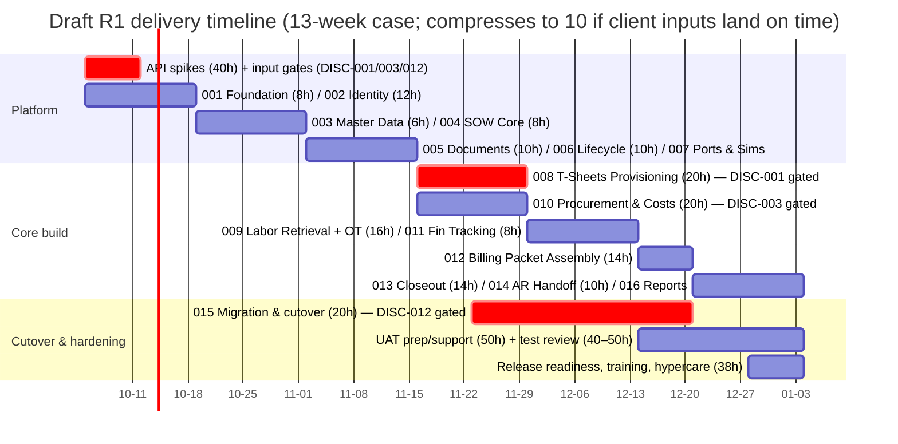

# Release Plan — ICE Services Project Lifecycle Platform

| Field | Value |
|---|---|
| Status | BMAD draft v1.0 (2026-09-26) |
| Source | `docs/source/phase-1-requirements-register-v2.2.md` v2.2 (authoritative) |
| Companion | `docs/product/feature-sequence.md`, `docs/product/requirements-traceability.md` |

## 1. Release Model

Three releases (R1, R2, R3) as assigned in the register. R1 is a *complete
vertical system* (setup → tracking → billing → closeout → AR handoff) for
labor + materials. R2 adds breadth (change orders, OT rules, equipment,
formats, reporting, GL). R3 adds accrual & project financial reporting.

```mermaid
gantt
    title Phase 1 release sequence (relative)
    dateFormat X
    axisFormat %s
    section R1
    Pre-R1 spikes (PP-047, DISC-001..004)      :a1, 0, 5
    R1 features 001-016 (core path)            :a2, 5, 40
    Migration + cutover (PP-044)               :a3, 40, 5
    section R2
    Features 017-021 (breadth)                 :b1, 45, 30
    section R3
    Feature 022 (accrual)                      :c1, 75, 10
```

*(Timeline is relative only. **D-031 is now DECIDED FOR DEVELOPMENT
(ADR-005):** the delivery model is two-track, relative, and input-gated —
Ralph (AI) is the primary implementer and the client/ICE input track is the
critical path. Calendar dates attach only when ICE commits input dates (the
>(the DISC-001 and DISC-012 spikes). See `docs/architecture/decisions/ADR-005-delivery-model.md`.)*

### Draft Delivery Timeline (from R1 hours estimate)

> **Draft (2026-09-29).** Source: `ICE_Services_SDD_Project_Hours_Estimate.xlsx`
> (R1 AI-first estimate — 502–556 human hours, 10–13 week planning calendar,
> overlapping workstreams). Weeks are relative to kickoff, per ADR-005: no
> calendar dates until ICE commits input dates (DISC-001, DISC-012, D-033).
> The 10-week low case assumes gating inputs land in their scheduled weeks;
> each slip of a 🟥 gate shifts everything downstream of it.
>
> The Gantt below anchors W1 to a hypothetical kickoff Monday (2026-10-05)
> purely so the bars render in sequence; the real calendar remains TBD per
> ADR-005, and week offsets (W0–W13) are what the plan commits to.

| Weeks | Workstream | Feature hours (estimate) |
|---|---|---|
| 1 | Kickoff; API spikes (T-Sheets, Procurement, HR, AR); 001 Platform & CI/CD | spikes 40h, 001 8h |
| 1–2 | 002 Identity & Access | 12h |
| 2–4 | 003 Master Data ‖ 004 SOW Core Setup | 6h + 8h |
| 4–6 | 005 Documents ‖ 006 Lifecycle & Audit; 007 Ports & Simulators | 10h + 10h |
| 6–8 | 008 T-Sheets Provisioning (🟥 DISC-001) ‖ 010 Procurement (🟥 DISC-003) | 20h + 20h |
| 8–10 | 009 Labor Retrieval + basic OT; 011 Financial Tracking | 16h + 8h |
| 10–11 | 012 Billing Packet Assembly | 14h |
| 11–13 | 013 Closeout ‖ 014 AR Handoff; 016 R1 reporting slice | 14h + 10h |
| 7–11 | 015 Data Migration & cutover (🟥 DISC-012 customer master), parallel to core build | 20h |
| 10–13 | UAT preparation/support; system-wide automated test review | 50h + 40–50h |
| 13 | Release readiness, training, cutover sign-off, hypercare | ~38h |

**Reading the draft:** feature implementation hours sum to 184h of the
502–556h total; the remainder is program-level work (BMAD/UX/architecture
packages, Spec Kit preparation, Claude Code oversight, external-system
validation, UAT, migration validation, training, coordination) that is
interleaved, not sequential. Per ADR-005 §3.7, the timeline re-baselines at
the point each 🟥 gate (DISC-001, DISC-012, D-033 credentials) resolves.

## 2. R1 — Core SOW Lifecycle (49 requirements)

### Scope
All R1-assigned requirements plus:
- **Minimum OT behavior for PP-023** (single default rule; part of the PP-015
  R1 slice, not the full PP-015 requirement).
- **Minimum notification for PP-069** (closeout task + email; part of the
  PP-043 R1 slice, not the full PP-043 requirement).

### Requirement set (R1)
| Epic | PP IDs |
|---|---|
| Epic 1 — SOW Setup | PP-001, PP-002, PP-003, PP-004, PP-005, PP-006, PP-007, PP-008, PP-009 |
| Epic 2 — Timekeeping | PP-010, PP-011, PP-012, PP-013, PP-014, PP-016 |
| Epic 3 — Tracking | PP-017, PP-018, PP-019, PP-022 |
| Epic 4 — Billing/Closeout | PP-023, PP-024, PP-026, PP-028, PP-029, PP-030, PP-031, PP-068, PP-069 |
| Epic 5 — Master Data | PP-033, PP-034, PP-035, PP-037 |
| Epic 6 — Integrations | PP-038, PP-039, PP-040, PP-053 |
| Epic 7 — Platform/Security | PP-041, PP-042, PP-044, PP-045, PP-046, PP-047 (Pre-R1), PP-049, PP-050, PP-051, PP-052, PP-056, PP-057, PP-070 |

**Count check:** 9 + 6 + 4 + 9 + 4 + 4 + 13 = **49** (PP-047 counted as the
Pre-R1 gate).

### Explicitly out of R1 (R1 boundary rule)
| PP ID | Reason |
|---|---|
| PP-015 (full) | Advanced OT config; R1 keeps only the minimum flag for PP-023 |
| PP-020 | Change orders — R2 |
| PP-021 | Progress billing data — R2 |
| PP-025 | Equipment packet section — R2 (source unidentified) |
| PP-027 | Client-specific formatting — R2 |
| PP-032 | Accrual support — R3 |
| PP-036 | OT rules configuration — R2 |
| PP-043 (full) | Notification center — R2 (R1 keeps PP-069 minimum only) |
| PP-048 | Executive dashboard — R2 |
| PP-054 | GL integration — R2 (mechanism TBC) |
| PP-055 | Write-offs & adjustments — R2 |
| PP-071 | Billing & AR reporting — R2 |
| PP-072 | Project financial / accrual reporting — R3 |

### Entry criteria (before Feature 001 builds)
1. ~~D-001 (platform stack) and D-002 (document storage) decided~~ — **now
   DECIDED FOR DEVELOPMENT** (ADR-001, ADR-002). Feature 001 scaffolding may
   proceed.
2. DISC-001 kickoff: T-Sheets spike (PP-047) started — it is the critical path.
3. ~~D-007 (identity mechanism) decided~~ — **now DECIDED FOR DEVELOPMENT**
   (ADR-003). Feature 002 depends on it.
4. D-029 (release controls) — **now DECIDED FOR DEVELOPMENT** (ADR-004);
   Feature 001 scaffolds the GitHub Actions pipeline + PROD approval gate.

> **All five before-001 decisions (D-001, D-002, D-007, D-029, D-031) are
> now DECIDED FOR DEVELOPMENT.** See `docs/architecture/decision-register.md`
> §10 and `docs/architecture/decisions/`. Development defaults vs production
> approach are made explicit in each ADR; client/IT confirmation items remain
> open (they gate real-adapter verification D-033 and calendar commitment,
> not the development path).

### Exit criteria
1. All 49 R1 requirements pass acceptance criteria (PRD §3) against simulators.
2. Spike report (PP-047) recorded; D-010 closed with fallback decision if needed.
3. Migration (PP-044) executed and validated; cutover sign-off (D-025).
4. Dry-run billing on ≥1 real historical SOW accepted by Ops Accounting.
5. RBAC, audit (PP-042), security log (PP-070), MFA (PP-050) verified.

## 3. R2 — Breadth (11 requirements)

### Scope
PP-015 (full OT engine), PP-020, PP-021, PP-025, PP-027, PP-036, PP-043,
PP-048, PP-054, PP-055, PP-071.

### Entry criteria
1. R1 in production (or at cutover sign-off).
2. D-008 (change order design) and DISC-009 closed.
3. D-012 + DISC-005: OT rules list obtained from client.
4. DISC-004: equipment/stock-issue source identified.
5. D-024 + DISC-014: GL interface mechanism confirmed.

### Exit criteria
1. OT rule engine handles default/project-type/client/after-hours/threshold
   rules; past R1 packets remain explainable (rule versioning).
2. Change orders: request → approve → budget delta → billing visibility.
3. Equipment section populated from identified source.
4. T&M/OMR packets include original estimate vs actuals summary.
5. Executive dashboard + billing/AR reports accepted by Finance/FP&A and
   Executive.

## 4. R3 — Accrual & Project Financial Reporting (2 requirements)

### Scope
PP-032 (accrual data support) and PP-072 (project financial / accrual-support
reporting: incurred labor/materials/equipment/subs, unbilled incurred,
estimated completion, accrual inputs by period, variance to budget). PP-072 is
not full GL journal posting (register note).

### Entry criteria
1. DISC-011: Shannon's accrual workbook/formula obtained.
2. R2 billing data (PP-031 billed-to-date) in production.

### Exit criteria
1. Unbilled labor, unbilled materials, estimated completion % available per SOW
   (PP-032).
2. Project financial / accrual-support reports available: incurred by
   category, unbilled incurred, estimated completion, accrual inputs by period,
   variance to budget (PP-072).
3. Output matches the manual accrual pull on a sample month (within agreed
   tolerance, D-032).
4. No journal posting implemented (out of Phase 1 scope).

## 5. Cross-Release Constraints

- **No production data assumption:** R1 development runs entirely on
  synthetic fixtures (`docs/data/synthetic-data-strategy.md`). Real-system
  verification happens in the DEV environment against real adapters after
  credentials are available (D-033).
- **R1 boundary is binding:** Ralph/Spec Kit must not pull R2/R3 scope into
  R1 features except the two minimum behaviors above (PP-023 OT flag, PP-069
  notification), and only where another R1 dependency explicitly requires it.
- **Feature sequencing:** see `docs/product/feature-sequence.md`. R1 = features
  001–016. R2 = features 017–021. R3 = feature 022. R2/R3 specs are written
  only when their entry criteria are met.

> **Numbering note:** the run brief's proposed slot "014 Change Orders and
> Billing Extensions" is R2 scope per the R1 boundary rule (PP-020/PP-021/
> PP-055 are all R2). It is delivered as Feature 017. See
> `docs/product/feature-sequence.md` §4 for the full renumbering rationale.

## 6. Risk-Driven Release Adjustments (contingencies)

| Trigger | Adjustment |
|---|---|
| T-Sheets spike (DISC-001) fails sub-code creation | Feature 008 switches to manual sub-code workflow + mapping table (D-010); R1 scope unchanged, effort shifts |
| Procurement API (DISC-003) unavailable | PP-024 falls back to CSV import of approved POs into the materials section; flag as degraded capability at R1 exit gate |
| HR source (DISC-006) never confirmed | EmployeeDirectory stays on the CSV/simulator adapter; admin-maintained employee list (accepted degradation, recorded) |
| AR mechanism (D-020) not confirmed by R1 exit | Ship with shared-folder deposit; portal/email deferred |
| Customer master file (DISC-012) not provided | Migration feature 015 blocks on it; R1 exit gate cannot pass (PP-044 🔴) |
