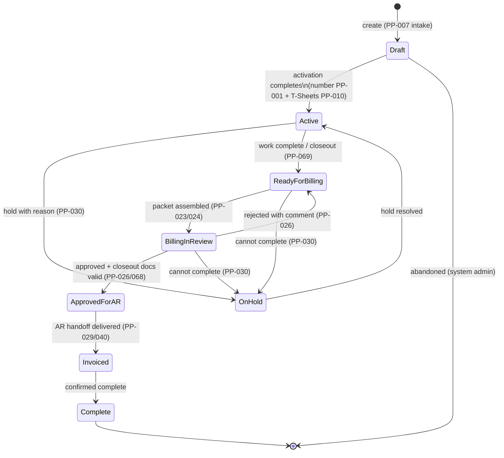
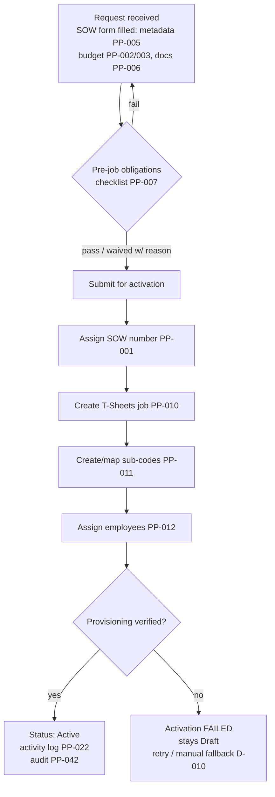
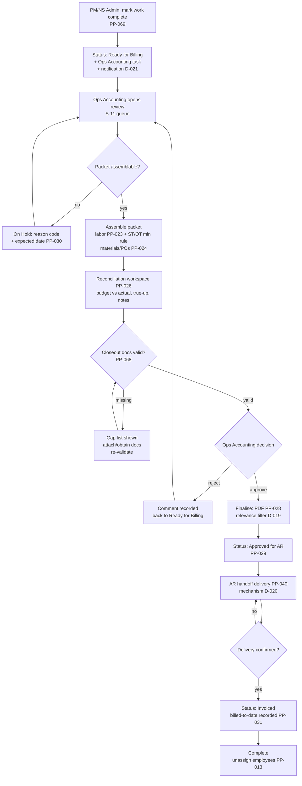
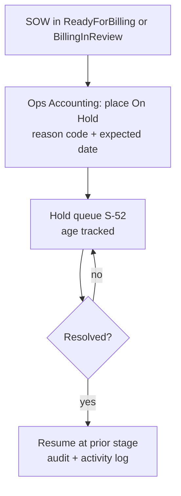
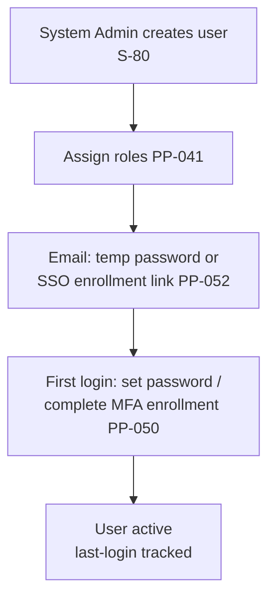
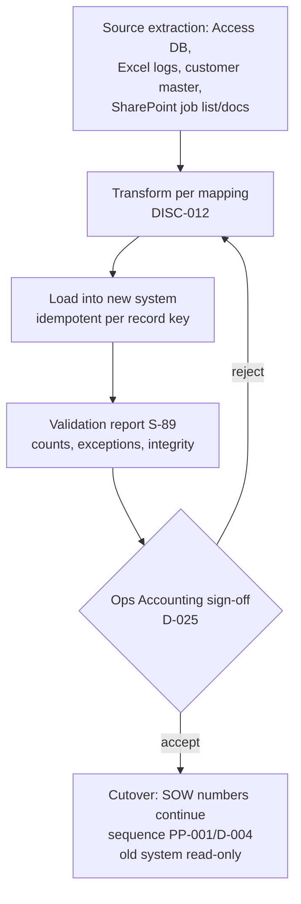

# Workflow Map — ICE Services Project Lifecycle Platform

| Field | Value |
|---|---|
| Status | BMAD draft v1.0 (2026-09-26) |
| Scope | R1 workflows (R2/R3 extensions noted) |
| Companion | `docs/ux/screen-inventory.md`, `docs/ux/ux-spec.md` |

## 1. SOW Lifecycle State Machine (PP-017)

Proposed transition matrix. The register requires the eight statuses but does
not fix every transition — the matrix below is the BMAD proposal; D-013
records where it needs confirmation.

**Transition rules**
- Every transition: allowed role (D-009), reason/notes where required,
  activity-log entry (PP-022), audit entry (PP-042).
- `Draft → Active` is atomic: number + T-Sheets provisioning; failure =
  stays Draft with retry (PP-007 AC-2).
- `BillingInReview → ReadyForBilling` (rejection) keeps the assembled packet
  as a draft artifact; the packet is regeneratable.
- `Invoiced` in R1 is set when AR handoff delivery is confirmed (PP-029);
  actual invoice confirmation from AR is out of Phase 1 scope.

## 2. Workflow WF-1 — SOW Intake & Activation (R1, PP-001…PP-012)

**Actors:** NS Admin (primary), PM (may initiate intake).
**Failure handling:** provisioning failures are visible in S-24 and S-83 with
retry; no half-activated SOW (number not consumed on rollback).

## 3. Workflow WF-2 — Project Execution & Tracking (R1, PP-014, PP-018, PP-019)

- Employees charge time in T-Sheets against sub-codes (external system).
- System pulls labor (PP-014) for budget-to-actual (PP-018, S-31/S-70) on
  demand + daily (D-015).
- Materials/PO data pulled from Procurement (PP-038) into S-34.
- PM/Field Lead monitors SOW detail; no state change required.
- **R2 extension:** change orders (PP-020) enter here as a parallel branch
  that adjusts budget and re-opens tracking.

## 4. Workflow WF-3 — Closeout & Billing Packet (R1, core)

**Actors:** PM/Field Lead (trigger), Ops Accounting (review/true-up/approve),
AR (receiver — external), System (assembly, validation, delivery).
**Key gates:** closeout document validation (PP-068) blocks at H and again at
finalisation (PP-026 AC-4). Rejection is never silent (mandatory comment).

## 5. Workflow WF-4 — Hold & Follow-Up (R1, PP-030)

## 6. Workflow WF-5 — User Onboarding (R1, PP-051, PP-052)

## 7. Workflow WF-6 — Data Migration & Cutover (R1, PP-044)

## 8. R2/R3 Workflow Extensions (noted)

- **WF-7 Change Order (R2, PP-020):** request CO → budget delta → approval
  workflow → apply to SOW budget → visible in billing. Re-enters WF-3 if
  billing already started (per D-008).
- **WF-8 OT Rule Evaluation (R2, PP-015/036):** rule selection by
  (client, project type, after-hours, threshold) → determination stored.
  Replaces the R1 minimum single-rule path in WF-3.
- **WF-9 Equipment Assembly (R2, PP-025):** equipment/stock-issue retrieval →
  equipment section in WF-3 (replaces placeholder).
- **WF-10 GL Sync (R2, PP-054):** billing identifiers / invoice numbers /
  payment status write-back per D-024.
- **WF-11 Accrual & Project Financial Reporting (R3, PP-032, PP-072):**
  monthly accrual-support export + project financial / accrual-support reports
  per DISC-011 formula.

## 9. Notification Touchpoints (R1 minimum)

| Event | Channel | Recipient | Ref |
|---|---|---|---|
| SOW created | in-app task (optional email) | NS Admin / owner | PP-007 (supporting) |
| Closeout requested | in-app task + email | Ops Accounting | PP-069, D-021 |
| Packet awaiting review | in-app queue highlight | Ops Accounting | PP-026 |
| SOW placed on hold | email | owner + Ops Accounting | PP-030 |
| AR handoff delivered/failed | email | Ops Accounting + AR contact | PP-029/040 |
| New user created | email | the user | PP-052 |

(R2: full configurable notification center — PP-043.)
