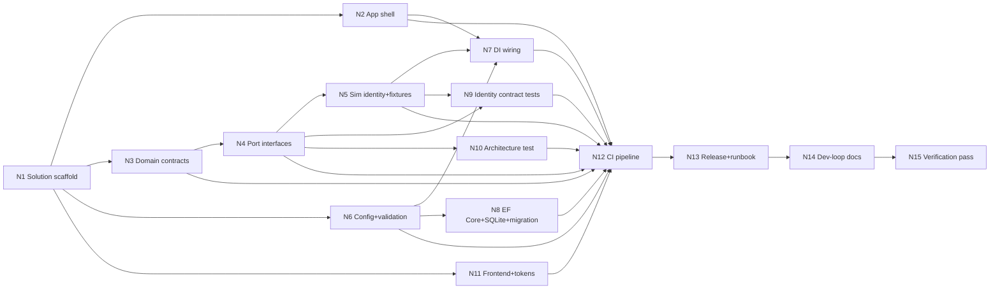

# Feature 001 — Implementation Plan

> Companion to `specification.md`. Ordering, risks, and the verification loop.
> Tasks N1–N15 are defined in `tasks.md`; this file is the *why* and the
> *shape* of the plan. Stack baseline: **C# / .NET 10 LTS** (ADR-006).

## 1. Phase order & rationale

```
Phase A — Tooling & shell              N1 → N2 → N3
Phase B — Ports, sim & data foundation N4 → N5 → N6 → N7 → N8 → N9 → N10
Phase C — Frontend                     N11
Phase D — CI/CD                        N12 → N13
Phase E — Docs & closeout              N14 → N15
```

Rationale:
- **A before B:** no code is written before the solution scaffolds and builds
  (N1) and the app shell boots (N2); the `dotnet restore → dotnet build →
  dotnet test` loop must work from day one (ADR-006 §4.3).
- **B before C:** simulators implement ports (N5) and ports must exist first
  (N4); the config model (N6) and DI wiring (N7) depend on the ports and the
  sim; EF Core + SQLite (N8) depends only on the config model (N6), not on DI.
- **B before D:** the CI gate (N12) asserts the architecture test (N10) and
  the contract tests (N9); those must exist or the gate is hollow.
- **C independent:** the frontend (N11) has no backend dependency in 001
  (static shell + tokens); it depends only on N1 and can run parallel with B.
- **D after B+C:** workflows reference the exact commands that must already
  work locally.
- **E last:** docs describe the final state; N15 is the verification pass.

## 2. Task dependency graph



Every prerequisite has a lower task number (no forward dependencies). N11 is
independent of the .NET backend chain (N2–N10) and may be parallelized.

## 3. Verification loop (Ralph's per-task contract)

Every task ends with:

1. **Local:** the task's verification command (in `tasks.md`) is green.
2. **Local full (from N2 onward):** `dotnet restore && dotnet build &&
   dotnet test` is green; **from N11 onward** also
   `cd src/ICE.ProjectLifecycle.Web && npm ci && npm run build`.
3. **Repo hygiene:** `git diff --check` clean; no new secrets; `package-lock.json`
   committed where the task touches frontend dependencies.
4. **Traceability:** the task's "Satisfies" line in `tasks.md` lists the AC(s)
   it closes; each AC is checkable in `specification.md` §6 and §14.

A task is *done* only when 1–4 hold. No task may leave the tree red.

## 4. Risks & mitigations

| # | Risk | Likelihood | Mitigation |
|---|---|---|---|
| R1 | Windows/Linux parity drift (dev on Windows, CI on Linux) | Medium | `package-lock.json` + NuGet central package management committed (ADR-006 §2); no Windows-only tooling in the CI gate; MSBuild path handling |
| R2 | Scope creep from ADR-006 §4.1's "simulator package" line | High | §4 split (specification) + non-goals table; N5 is identity-only; 007 spec will claim the rest |
| R3 | `src/` layout confusion for Ralph | Low | **Resolved** (ADR-006 §3): C# projects live **under `src/`** as the natural MSBuild layout; the old `src/` vs `app/` conflict no longer applies |
| R4 | Pending-IT items silently become requirements | Medium | specification §12.2 table is normative; N15 re-verifies no secret/target value is committed |
| R5 | Architecture test is too weak (doesn't catch real violations) | Medium | N10 includes a *deliberate-violation* negative test; the test itself is the spec |
| R6 | Prod-forbids-sim validation not actually enforced | Low | A3 has explicit unit tests for each provider key in prod mode |
| R7 | Frontend build fails in CI on Linux due to platform packages | Low | Vite is pure-JS; `npm ci` from lockfile; no native deps in 001 |
| R8 | EF Core baseline diverges from later migrations | Low | Pin versions via `Directory.Packages.props`; N8 verifies up/down on a temp SQLite file |
| R9 | Ralph implements 007 sim adapters early | Medium | Non-goals table + N5 acceptance criteria name the 7 excluded adapters explicitly |
| R10 | `.gitignore` misses `sim-state/` → runtime state committed | Low | N1 adds `bin/ obj/ sim-state/ *.db`; N15 scans the tree |
| R11 | .NET 10 SDK not installed locally (9.0.313 present) | Medium | Assumption A1 (specification §13): install the .NET 10 SDK before building, or CI uses `actions/setup-dotnet@v4` 10.x |

## 5. Exit criteria for Feature 001 (feature-level "done")

All of `specification.md` §6 (A1–A12) verified, **and**:

- `git diff --check` clean; no secrets in the tree.
- CI green on `main` after the final task is merged.
- The issues in specification §13 are either resolved or explicitly
  accepted by the human reviewer.
- Feature 002's spec can be written against the actual code (ports, config,
  sim model) without re-deriving conventions.

## 6. What this plan explicitly does NOT do

- No application feature code beyond the shell (specification §5 non-goals).
- No real adapters, no domain tables, no RBAC, no login.
- No calendar commitments (ADR-005 §3).
- No changes to `docs/` BMAD artifacts (they are authoritative inputs).
- No commits to `main` without the PR/review gate that 001 itself documents
  (N13 runbook applies to subsequent work; 001's own merge follows whatever
  protection IT has configured — tracked as open in §12.2).

## 7. Amendment log

| Date | Change | Reason |
|---|---|---|
| 2026-09-26 | Initial plan | Spec Kit v1, Feature 001 |
| 2026-09-27 | Re-baselined to C# / .NET 10 LTS (N1–N15); T01–T14 → N1–N15; Python tooling → `dotnet`/`dotnet ef`/xUnit; R3 resolved; R8 → EF Core; R10 → `bin/ obj/ sim-state/` | ADR-006 supersedes ADR-001 (platform stack corrected to .NET before implementation) |
